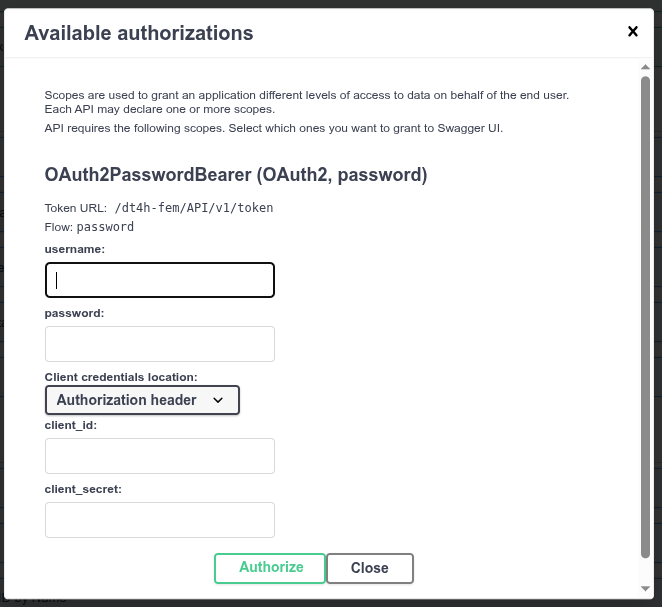

# API for Federated Processing Environment

The *Federated Processing Environment* (FEM) also provides an API interface that can be used to programmatically trigger distributed and federated experiments.

* The URL to the API is: `https://fl.bsc.es/dt4h-fem/API/v1/docs`

## Authorize User

In order to use the API, authorization is required by pressing the `Authorize` button located at the top-right corner.

The required credentials are the same ones used to authenticate any user in the web interface of the *Federated Processing Environment* or any other DT4H product.

## Basic Knowledge

In FEM, a "tool" is the core component of any experiment. It refers to a complete piece of software that can be run in a distributed or federated manner. A "tool," therefore, can include one or more "tasks." For example, software that is run exclusively in a distributed manner will have a single "task," while a federated software, for instance a federated learning framework which requires at least an aggregator and one or more trainers, will have two or more "tasks."

An "execution" is the record of a performed job. It can consist of one or more "tools" or "tasks." For example, when running a `health-check` (a "tool" with a single "task"), we log an execution ID to trace the user who triggered the execution and the nodes on which it was run. Similarly, we can run a `health-check` tool followed by an `Flcore` tool (a single tool with two tasks: `flcore-server` and `flcore-client`), and all of them will be logged under a single execution ID.

## Endpints

### Hosts
A "host" is a node or machine that has the FEM client installed. Therefore, it is a location where "tools" and "tasks" can be run.

* `/hosts` (_GET_): Lists all the "hosts" that are part of the "federated network" of DT4H.
* `/hosts/resources` (_GET_): Lists the available resources of one or more "hosts".
* `/hosts/heartbeat` (_GET_): Triggers a `heartbeat` on one "host". The `heartbeat` checks whether a given FEM client is connected to the RabbitMQ service.
* `/hosts/datasets` (_GET_): Lists all available input datasets on all "hosts" that are part of the "federated network" of DT4H.
* `/hosts/{host_id}` (_GET_): Provides the description of a "host" stored in FEM’s internal database.

### Tools
A "tool" is the definition of a piece of software in FEM. A "tool" can include one or more "tasks" depending on its execution mode: distributed or federated.

* `/tools/` (_GET_): Lists all "tools" available in DT4H.
* `/tools/{tool_id}` (_GET_): Provides a detailed description of a single "tool" given its ID.
* `/tools/job/{tool_id}` (_POST_): Triggers a "tool" on one or multiple "hosts" (if necessary, specifying a server or main host and one or more client hosts).

### Tasks
A "task" is the part of a "tool" that is executed on a "node".

* `/tasks` (_GET_): Returns the list of available "tasks" in DT4H.
* `/tasks/{task_id}` (_GET_): Returns the internal description of a single "task".

### Data
Data can only be queried and downloaded by its owner.

* `/data/list_files` (_GET_): Lists all available output files for a user for a given "execution" or on a given "host".
* `/data/download_files` (_GET_): Downloads a single file if specified for a given "execution" on a given "host". If no file is specified, it downloads all available results for that "execution" on the given "host".

### Executions

* `/executions/status/{execution_id}` (_GET_): Returns the status of a given execution.
* `/executions/cancel_run/{execution_id}` (_GET_): Cancels a given execution.
* `/executions/logs/{execution_id}` (_GET_): Retrieves the logs of a given execution.
* `/executions/report/{execution_id}` (_GET_): Returns the resource consumption, exit code, start time, stop time, and elapsed time for the execution.

