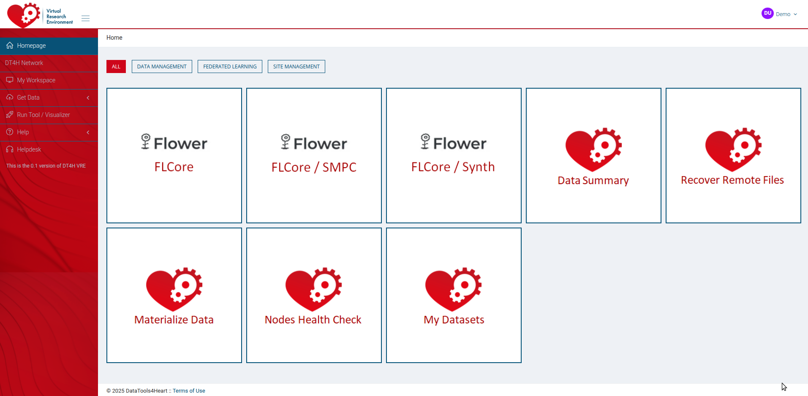
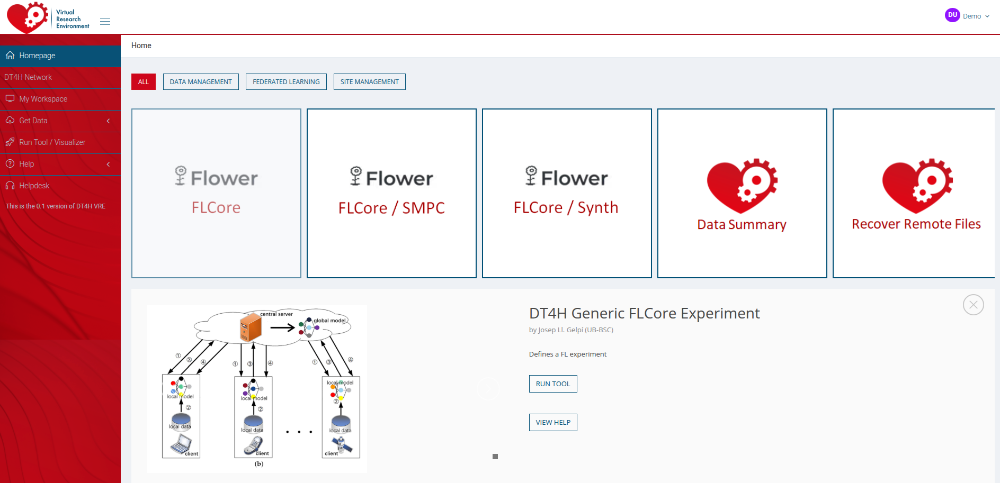
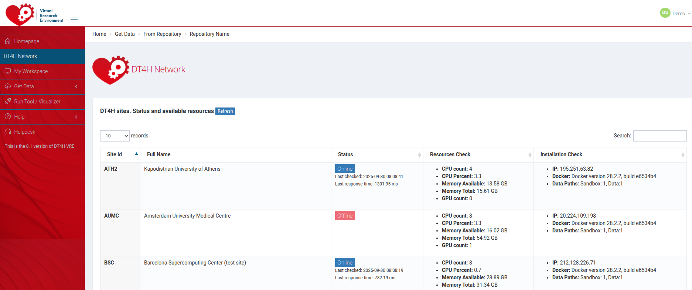
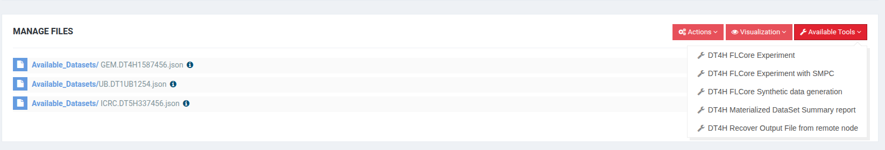
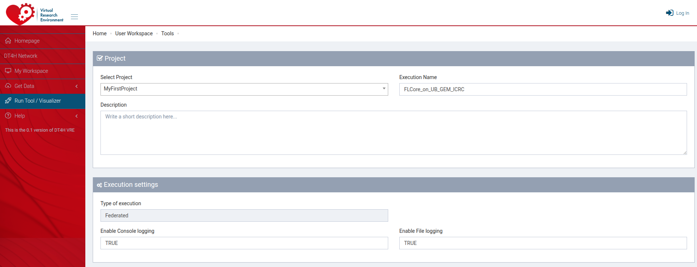
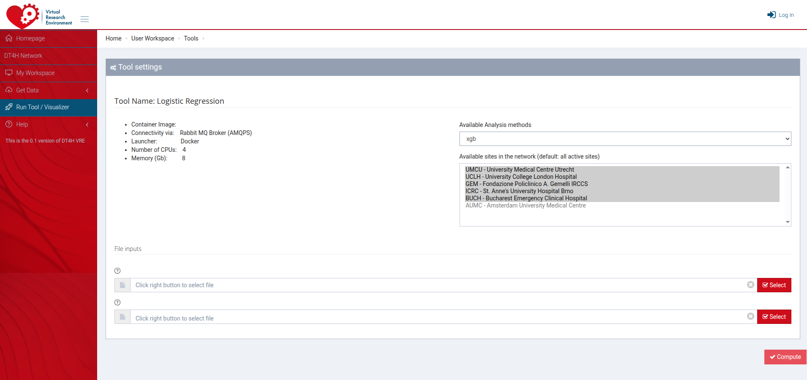
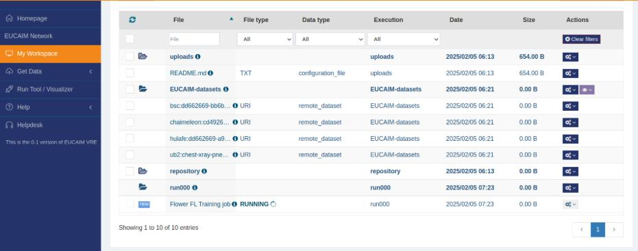
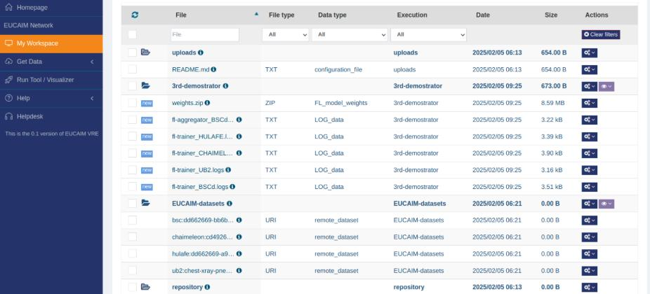

# Federated Processing Environment

## Welcome and Tool Selection

After logging into the DT4H platform, the home page of the *Federated Processing Environment* shows the multiple tools available for distributed and federated experiments. The current image (Figure 1) shows a series of tools like both `FLCore`.

Clicking on any of the tools opens a tab at the bottom of the page with a general description of the tool's purpose and requirements. This tab also allows us to access the dataset selection and tool configuration pages of the tool by clicking on "RUN NOW".

## Network Status

Using the left bar, the user can check the status of the federated network.

## Dataset Selection

Once a tool is selected, or if the user accesses the "My Workspace" section of the right bar, the list of available datasets is presented. Only datasets that the user has access to are listed here. 

In order to run a tool, one or more datasets must be selected. This can be done by selecting a "collection" of datasets or by selecting datasets one by one.

## Tool configuration

Once the datasets for an experiment are selected, the configuration of the tools is displayed. Each tool has a different configuration page, according to the parameters and arguments they require.

In the previous image, the tool `FLCore` is used to depict the configuration page. `FLCore` is a tool for federated learning; therefore, it requires the deployment of a server where the partial models will be aggregated and multiple clients where the partial models will be trained. In the example, the server is deployed at the "Barcelona Supercomputing Centre" and the clients at 4 different nodes.

Finally, a few extra parameters are required to configure the federated learning experiment, like the performance capacity of the server and the location of the images to be run for both the server and the client.

## Experiments

After the experiment is set up and launched, the "My Workspace" shows both the datasets and the current waiting and running experiments.

## Results

Once the experiment is finished, the gathered results will be displayed at the "My Workspace" with a "new" tag.

For the current example, the result of a `FLCore` experiment, the final aggregated weights of the model are returned as a zip file. Moreover, the logs of the training process for each node are also delivered for possible future inspection.