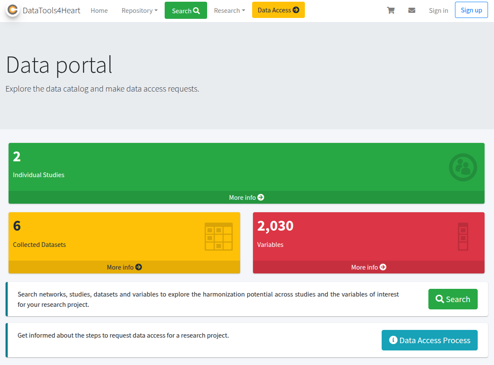
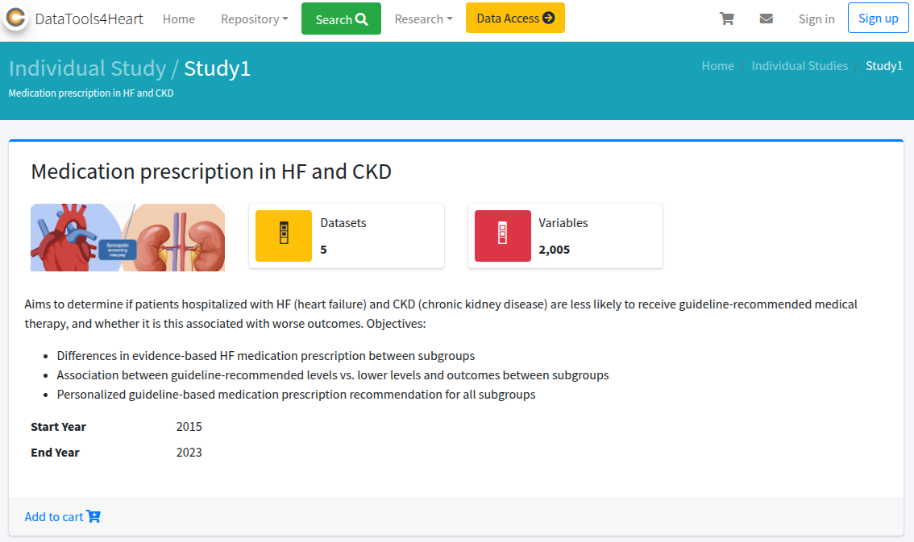

# Metadata Catalogue

The open-access Metadata Catalogue aims to enable clinicians, researchers, and AI data scientists to structure and navigate existing and new DataTools4Heart EHR-extract datasets. It provides a comprehensive web-based interface with advanced search, filtering, and visualization capabilities, allowing users to explore metadata in a structured manner.

### Access
The Metadata Catalogue can be found here: https://catalogue.datatools4heart.bsc.es

### Table of contents
1. [Homepage](#1-homepage)  
2. [Browsing Studies](#2-browsing-studies)  
   - [Datasets](#21-datasets)  
   - [Variables](#22-variables)  
3. [Search Functionality](#3-search-functionality)  
4. [Data Access Process (Public View)](#6-data-access-process-public-view)  
5. [Tips for Navigation](#8-tips-for-navigation)  
6. [Troubleshooting & FAQ (Public Access)](#9-troubleshooting--faq-public-access)  
7. [Glossary (Relevant Terms)](#11-glossary-relevant-terms)  

---

## 1. Homepage

The **DataTools4Heart Catalogue** is an AI-ready cardiology dataset discovery portal based on the **Mica (OBiBa)** platform.  
It provides public access to study metadata, dataset descriptions, variables, and access request procedures.
It does **not** host raw individual-level data; rather, it provides metadata, summary statistics and information on how to gain access

This manual explains how to navigate the **public-facing** sections of the catalogue.

When you access the website, the homepage introduces the catalogue and provides the main navigation menu.

The landing page shows a top navigation menu with:
- A search bar (“Search networks, studies, datasets and variables …”) to type keywords. 
- Quick links to Individual Studies, Collected Datasets, Variables.

Also a brief description of the  catalogue content with some statistics, like the number of variables or datasets.

The top navigation bar usually contains links such as:
- **Home**
- **Repository**
- **Data Access Process**
- Other informational pages (About, Contact, etc.)

---

## 2. Browing Studies

The Repository serves as the entry point to studies, datasets, and variables. You can explore metadata in read-only mode without logging in.

### 2.1 Individual Studies

Clicking on *Individual Studies* displays a list of cardiology-related studies. For example, "Study 1", related to DT4H 'Use Case 1'.

Each study entry usually shows:
- Study title
- Brief description
- Metadata or links to datasets

You can click on any study to see more details.

A public study page typically includes:
- Description
- Objectives
- Institutions or data owners
- Inclusion criteria
- Populations
- Datasets linked to that study
- Policy and access rules
 
``

---

### 2.2 Datasets

Under *Collected Datasets*, you can view a public list of available dataset descriptions.

``

DT4H includes two type of Datasets depending on the type of information they contain:
- **Features Code Books**: allows browsing the variables description of the extracted features associated to each study. E.j. type of data, associated dictinoaries, annoatations, etc.
- **Data Availability**: allows broswing the presence/absense of the extracted feature grouped per center (*i.e.*federated data node)

---

### 2.2 Variables

The *Variables* section allows public browsing of AI-ready features extracted as extracted from the FHIR-based common data model of DataTools4Heart.

``

Users can typically see:
- Variable label/name
- Source (study/dataset)
- Data type or category (if displayed publicly)

---

## 3. Search Functionality

The catalogue includes a global search bar or a dedicated search page. You can search studies, datasets, or variables by keywords.

``

---

## 4. Data Access Process (Public View)

A dedicated page explains:
- Steps to request data
- Eligibility or governance structure
- Policies and conditions
  
``

As a public user, you can read the procedures before any account-based actions.

Some catalogues display a public list of projects that have already obtained data access.

``

This section may include:
- Project title
- Lead institution
- Summary or objectives

---

## 5. Tips for Navigation

- Use the main menu to switch quickly between sections.
- Explore the Repository first to understand the scope of cardiology datasets.
- Use keywords in the search bar to find relevant studies or variables quickly.
- Public view generally does **not** allow data downloads or detailed variable inspection.

---

## 6. Troubleshooting & FAQ (Public Access)

| Issue | Explanation | Suggested Action |
|------|-------------|-------------------|
| Limited metadata visibility | Public mode hides detailed fields | Consider contacting catalogue administrators |
| No download option | Public view does not include direct access | Refer to the Data Access Process page |
| Broken links or missing info | Under maintenance or restricted | Wait or report to support contacts |

---

## 7. Glossary (Relevant Terms)

- **Mica / OBiBa**: Software platform for metadata cataloguing and data access management.
- **Study**: A research initiative providing structured datasets.
- **Dataset**: A collection of data fields associated with a study. In DT4H context, it corresponds to a group of features hosted in a particular federated node.
- **Variable**: A specific data element or field within a dataset. In DT4H context, it corresponds to AI-ready features
- **Data Access Request**: Formal process for requesting restricted data.
- Tutorials for requesting AI-ready cardiology data

---

