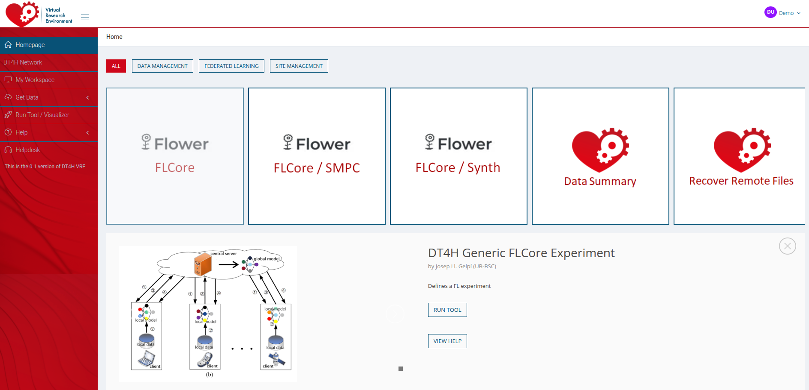

# FLCore

This library provides a flexible and extensible framework for running experiments in a federated learning environment, enabling the training and evaluation of different machine learning models across distributed datasets.

The following methods are currently implemented along with the flwr aggregation method used and the code used for selecting a specific method.

 | Model              | Aggregation method (Flwr) | Code                   |
| ------------------- | --------------------------- | ------------------------ |
| Logistic Regression | Federated Average           | `logistic_regression`    |
| SGD Classifier      | Federated Average           | `lsvc`                   |
| Elastic Net         | Federated Average           | `elastic_net`            |
| Random Forest       | Custom                      | `weighted_random_forest` |
| Deep Learning       | Federated Average           | `neural_network`         |

 Parameters are provided using a command line interface and are organized by category and include their name, type, default value, and a brief explanation. These arguments can be modified at runtime to customize data handling, model configuration, training setup, and infrastructure details. The next table summarizes the variables needed for the client.

 | Parameter                       | Type        | Default value                                          | Description                                                                                                   |
| ------------------------------- | ----------- | ---------------------------------------------------------- | ------------------------------------------------------------------------------------------------------------- |
| `--dataset`                     | `str`       | `None`                                                     | Nombre del dataloader a usar.                                                                                 |
| `--data_id`                     | `str`       | `None`                                                     | Identificador del archivo del dataset.                                                                        |
| `--normalization_method`        | `str`       | `IQR`                                                      | Método de normalización. Opciones: `IQR`, `STD`, `MIN_MAX`.                                                   |
| `--train_labels`                | `list[str]` | `None`                                                     | Etiquetas usadas para entrenamiento.                                                                          |
| `--target_label`                | `list[str]` | `None`                                                     | Etiqueta(s) objetivo para predicción.                                                                         |
| `--train_size`                  | `float`     | `0.8`                                                      | Fracción del dataset usada para entrenamiento. Debe estar en `[0,1)`.                                         |
| `--num_clients`                 | `int`       | `1`                                                        | Número de clientes en el escenario federado.                                                                  |
| `--model`                       | `str`       | `random_forest`                                            | Modelo base a entrenar.                                                                                       |
| `--num_rounds`                  | `int`       | `50`                                                       | Número de rondas de entrenamiento federado.                                                                   |
| `--checkpoint_selection_metric` | `str`       | `precision`                                                | Métrica usada para selección de checkpoints.                                                                  |
| `--dropout_method`              | `str`       | `None`                                                     | Método de dropout aplicado en el entrenamiento.                                                               |
| `--smooth_method`               | `str`       | `None`                                                     | Método de suavizado de pesos.                                                                                 |
| `--random_forest`               | `json`      | `{"balanced_rf": "true"}`                                  | Parámetros para Random Forest. La bandera `balanced_rf` indica balanceo de pesos de clase.                    |
| `--weighted_random_forest`      | `json`      | `{"balanced_rf": "true", "levelOfDetail": "DecisionTree"}` | Parámetros para Weighted Random Forest. Incluye `balanced_rf` y `levelOfDetail` para granularidad de árboles. |
| `--neural_network`              | `json`      | `{"dropout_p": 0.2, "device": "cpu", "local_epochs": 10}`  | Configuración para redes neuronales: probabilidad de dropout, dispositivo (`cpu` o `cuda`), y épocas locales. |
| `--T`                           | `int`       | `20`                                                       | Número de muestras Monte Carlo para dropout bayesiano.                                                        |
| `--linear_models`               | `json`      | `{"n_features": 9}`                                        | Número de características de entrada esperadas por el modelo lineal.                                          |
| `--sandbox_path`                | `str`       | `/sandbox`                                                 | Directorio sandbox para ejecución aislada o almacenamiento temporal.                                          |
| `--certs_path`                  | `str`       | `/certs`                                                   | Directorio con certificados para comunicación federada segura.                                                |
| `--data_path`                   | `str`       | `/data`                                                    | Ruta principal del dataset.                                                                                   |

The following table summarizes the variables required for the server command line.

 | Parameter                       | Type        | Default value                                          | Description                                                                                                   |
| ------------------------------- | ------ | --------------------------------------------------------------- | -------------------------------------------------------------------------------------- |
| `--num_clients`                 | `int`  | `1`                                                             | Número de clientes en el entrenamiento federado.                                       |
| `--num_rounds`                  | `int`  | `50`                                                            | Número de rondas de entrenamiento federado.                                            |
| `--model`                       | `str`  | `random_forest`                                                 | Modelo a entrenar (`random_forest`, `weighted_random_forest`, `neural_network`, etc.). |
| `--random_forest`               | `json` | `{"balanced_rf": "true"}`                                       | Parámetros de Random Forest, incluyendo balanceo de clases.                            |
| `--experiment`                  | `json` | `{"name": "experiment_1", "log_path": "logs", "debug": "true"}` | Configuración del experimento: nombre, directorio de logs, modo debug.                 |
| `--local_port`                  | `int`  | `8081`                                                          | Puerto local para comunicación/servidor.                                               |
| `--production_mode`             | `str`  | `True!`                                                         | Activa el modo producción (modifica logging y ejecución).                              |
| `--checkpoint_selection_metric` | `str`  | `precision`                                                     | Métrica usada para selección de checkpoints.                                           |
| `--weighted_random_forest`      | `json` | `{"balanced_rf": "true", "levelOfDetail": "DecisionTree"}`      | Configuración del Weighted Random Forest.                                              |
| `--dropout`                     | `json` | `{"percentage_drop": 0}`                                        | Parámetros de dropout (fracción de pesos/nodos eliminados).                            |
| `--smoothWeights`               | `json` | `{"smoothing_strenght": 0.5}`                                   | Parámetros del método de suavizado.                                                    |
| `--certs_path`                  | `str`  | `./`                                                            | Ruta a certificados para comunicación segura.                                          |
| `--sandbox_path`                | `str`  | `./`                                                            | Directorio sandbox para pruebas/archivos temporales.                                   |
| `--dataset`                     | `str`  | `dt4h_format`                                                   | Nombre del dataset o dataloader.                                                       |
