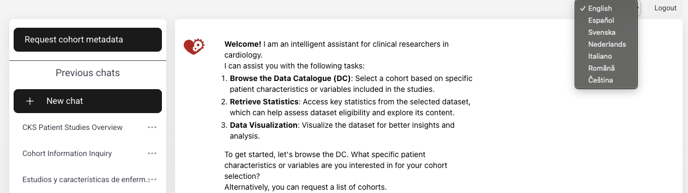
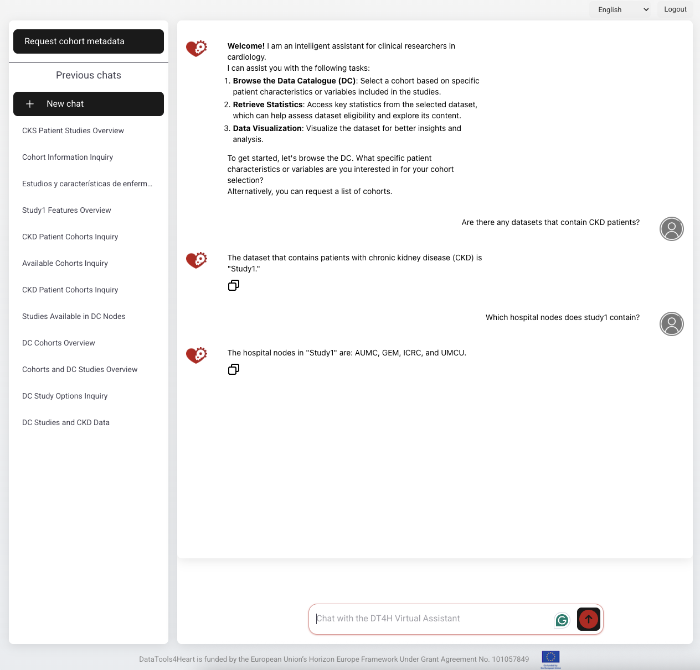
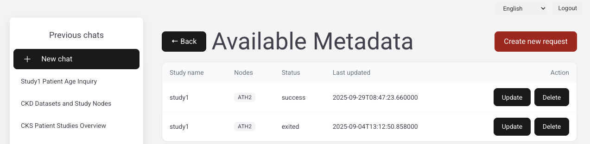
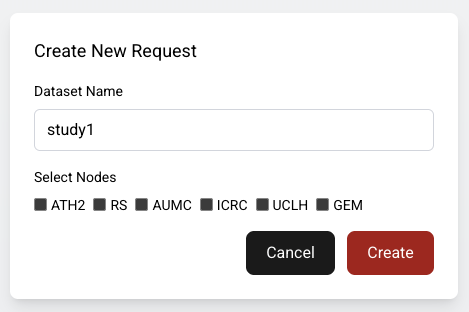

# Virtual Assistant Documentation

The **DT4H Virtual Assistant (VA)** is a tool designed to support clinical researchers in cardiology and related fields. It enables researchers to interact in seven languages for the following tasks:

- Search for and explore studies, cohorts, and patient datasets  
- Request and retrieve metadata before starting deeper exploration  
- Ask targeted questions regarding study characteristics, patient cohorts, or hospital nodes  
- Perform metadata requests in a federated way using a Secure Multi-Party Computation (SMPC) algorithm, ensuring data privacy and compliance with EU standards  

> **Note:** Metadata retrieval may take several minutes due to the distributed computation across nodes. It is recommended to request metadata at the beginning of a session.

All chat history with the VA is automatically stored. Researchers can browse previous conversations at any time, and they have the option to delete or export them.

---

## Supported Languages

The VA supports interaction in 7 languages, selectable from the top-right menu:

- English  
- Español (Spanish)  
- Svenska (Swedish)  
- Nederlands (Dutch)  
- Italiano (Italian)  
- Română (Romanian)  
- Čeština (Czech)  

Researchers can seamlessly switch between languages during interaction, ensuring accessibility across the European research community.

  

<em>Language selection in the VA</em>

---

## Main Features

### Study Search and Exploration

Researchers can use the VA to look for studies with specific patient characteristics, such as chronic kidney disease (CKD). Once a study of interest is identified, the VA also provides detailed information about the hospitals (nodes) that are included in the study. The results are retrieved from the **Data Catalogue (DC)**, which displays the relevant datasets together with their associated attributes.

  

<em>Example of study search in the VA</em>

---

### Metadata Request (Federated Step)

Before starting a conversation, researchers can request cohort metadata. This step runs a secure computation across all selected nodes using the SMPC algorithm.

**Steps:**  
1. Select *Request cohort metadata* from the left-hand menu and **Create new request**  
2. Choose the dataset name (e.g., `study1`)  
3. Select the (hospital) nodes to include (e.g., GEM, AUMC)  
4. Click **Create**  

> **Note:** This step may take several minutes to complete. The status of the metadata request is shown (e.g., running, exited).

  

<em>Overview of aggregated metadata requests</em>

  
   
  <em>Creating a new metadata request for a specific study and nodes</em>

---

### Conversation with the VA

Once metadata is available, researchers can:  
- Ask questions about patient characteristics (e.g., CKD, heart failure)  
- Retrieve key statistics from the datasets  
- Use data visualization tools for insights  

The VA ensures results are based on privacy-preserving federated queries across distributed hospital nodes.
